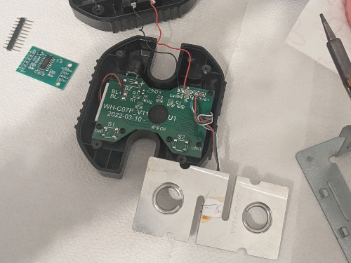
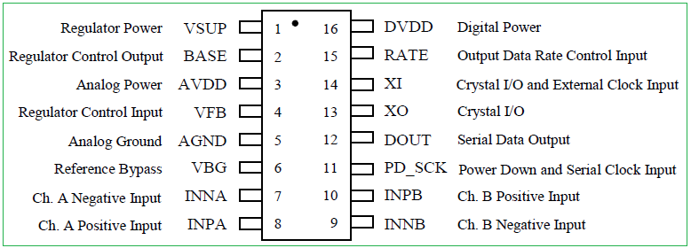

# Making Your Own Crimpdeq

1. Required Materials
    - [ESP32-C3-DevKit-RUST-1](https://github.com/esp-rs/esp-rust-board?tab=readme-ov-file#where-to-buy)
        - Other ESP32 devices can be used, but you need to figure out how to charge the battery
    - [Battery Holder](https://es.aliexpress.com/item/1005006283753220.html?spm=a2g0o.order_list.order_list_main.5.4779194d1mFZpd&gatewayAdapt=glo2esp)
    - [18650 Battery](https://es.aliexpress.com/item/1005007923191656.html?spm=a2g0o.order_list.order_list_main.11.4779194d1mFZpd&gatewayAdapt=glo2esp)
      - Other batteries might also work, as long as they can power the device
    - [Crane Scale](https://es.aliexpress.com/item/1005002719645426.html?spm=a2g0o.order_list.order_list_main.17.4779194d1mFZpd&gatewayAdapt=glo2esp) or [Amazon alternative](https://www.amazon.es/dp/B08133JCM6)
      - Other crane-scales might also work
    - [HX711](https://www.amazon.es/dp/B0DJX8BPQL)
2. Disassemble the Crane Scale
    
    1. Desolder the battery connections.
    2. Desolder the four wires of the load cell (`E-`, `S-`, `S+` and `E+`) from the PCB
        
    4. Unscrew and remove the PCB along with the display.
3. Soldering Instructions
    1. Modify the HX711 Module: Most HX711 modules come with the `RATE` pin connected to `GND`, meaning that they sample at 10 Hz, if you want to sample at 80 Hz:
        
       1. Break the track of `RATE` pin.
          1. I did this by scratching the module with a knife
       2. Verify with a multimeter that `GND` and the `RATE` pin are not connected anymore
            - Make sure that you dont break the next connection
       3. Solder the `RATE` to `VDD` pin
       4. Verify with a multimeter
    2. Connect the Crane Scale to the HX711:
      - Solder the 4 wires of the crane scale to the HX711. Usually the colors are:

        | **HX711 Pin** | **Load Cell Pin** | **Description**                    |
        | ------------- | ----------------- | ---------------------------------- |
        | E+            | E+ (Red)          | Excitation positive (to load cell) |
        | E-            | E- (Black)        | Excitation negative (to load cell) |
        | S+            | S+ (Green)        | Signal positive (from load cell)   |
        | S-            | S- (White)        | Signal negative (from load cell)   |

        - Note that sometimes the `S` pins are referred as `A`
    3. Connect the HX711 to the ESP32-C3-DevKit-RUST-1 devkit:

     | **HX711 Pin** | **ESP32-C3 Pin** | **Description**                |
     | ------------- | ---------------- | ------------------------------ |
     | VCC           | 3.3V             | Power supply (3.3V)            |
     | GND           | GND              | Ground                         |
     | DT (Data)     | GPIO4            | Data output from HX711         |
     | SCK (Clock)   | GPIO5            | Clock signal for communication |

     

    4. Verify all the connections with a multimeter
4. Adapt the Scale Case:
   1. Create space for the USB connector
       - I did this by placing the devkit, marking the space that I needed with a pen and then, heating a knife and melting the case.
   2. Install the battery holder:
      1. Glue, with some silicone, the battery holder, make sure to leave the lid for the original batteries of the scale open, as there is a hole for which you need to introduce the two wires of the battery holder.
      2. Solder the positive wire (red) of the battery holder to a switch/button, to turn on/off the device, then, solder the other pin the button/switch to the `B+` pin of ESP32-C3-DevKit-RUST-1.
      3. Solder the negative wire (black) of the battery holder to the `B-` pin of the ESP32-C3-DevKit-RUST-1.
   3. Close the case
      1. Ensure all components are securely installed before closing the case.
   
5. Upload the firmware:
   1. Connect your device with an USB-C
   2. Pull the `crimpdeq` repository:
        ```bash
        git clone https://github.com/SergioGasquez/crimpdeq.git
        ```
        If you dont have git installed on your system, you go to the green Code button and use the "Download ZIP" option.
   3. Upload the firmware to your device:
      1. Download the binary from the desired [GitHub release](https://github.com/SergioGasquez/crimpdeq/releases)
      2. Open [esp.huhn.me](https://esp.huhn.me/)
      3. Click Connect and select the serial port of your ESP board
      4. Upload your .bin file(s)
      5. Click Program

        See [this blogpost](https://blog.spacehuhn.com/espwebtool) for more details
   4. Check if the calibration values work for your scale:
      1. Connect your device with ClimbHarder or Tindeq apps
      2. Use the "Live View" option
      3. Measure a known weight and verify that Crimpdeq measures the right value
         1. If Crimpdeq calibration is off, see the [Calibration chapter](calibration.md)


