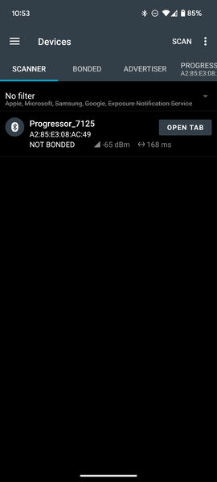
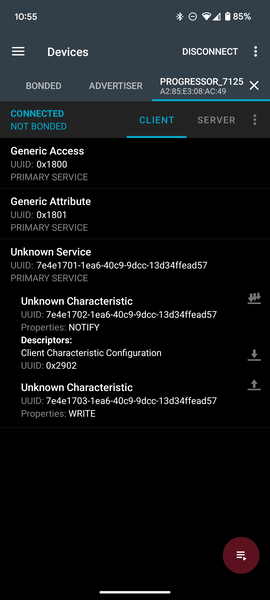
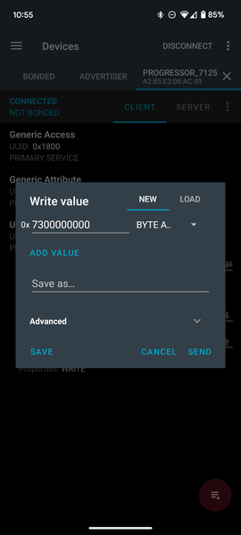

# Calibration

This guide will help you calibrate your Crimpdeq device to ensure accurate weight measurements. The calibration process involves using a known weight to establish a reference point for the device's measurements.

1. Download and install the nRF Connect app for your platform:
   - [Android](https://play.google.com/store/apps/details?id=no.nordicsemi.android.mcp&hl=es_419)
   - [iOS](https://apps.apple.com/es/app/nrf-connect-for-mobile/id1054362403)
   - [Desktop](https://www.nordicsemi.com/Products/Development-tools/nRF-Connect-for-Desktop/Download#infotabs) (Windows, Linux, macOS)
2. Connect nRF Connect with Crimpdeq:
   1. Launch the nRF Connect app.
   2. Navigate to the Scanner tab.
   3. Look for a device named "Progressor_7125".
   4. Tap "Connect".
   5. Once connected, the app will display the device's services and characteristics.
      
3. Locate the Calibration Characteristic:
   1. Expand the "Unknown Service" section.
   2. Look for the characteristic with UUID: `7e4e1703-1ea6-40c9-9dcc-13d34ffead57`.
      
4. Calculate the Hex Value of your known weight:
   1. Open the [Floating Point to Hex Converter](https://gregstoll.com/~gregstoll/floattohex/).
   2. Use "Single-precision" floating point converter.
   3. Enter your known weight in the "Float value" field.
   4. Click "Convert to hex".
   5. Save the resulting "Hex value".
      **Example:** For a known weight of 75.3 kg, the hex value would be `0x4296999a`.
5. Perform Calibration:
   1. Hang your Crimpdeq with no weight attached.
   2. Send the command `7300000000` to the characteristic:
      - Tap the Up Arrow icon on the characteristic (`7e4e1703-1ea6-40c9-9dcc-13d34ffead57`).
      - Enter the command as shown in the screenshot.

         
   3. Now, attach your known weight to the Crimpdeq.
   4. Prepare the calibration command:
      - Take your hex value from the previous step.
      - Add `73` at the beginning.
       **Example:** For 75.3 kg (0x4296999a), the command would be: `734296999a`.
   5. Send this new command to the same characteristic (`7e4e1703-1ea6-40c9-9dcc-13d34ffead57`).

## Important Notes
- The known weight should be greater than the maximum weight you plan to measure.
- Make sure the device is stable and not moving when sending calibration commands.
- The calibration process should be performed in a controlled environment.

